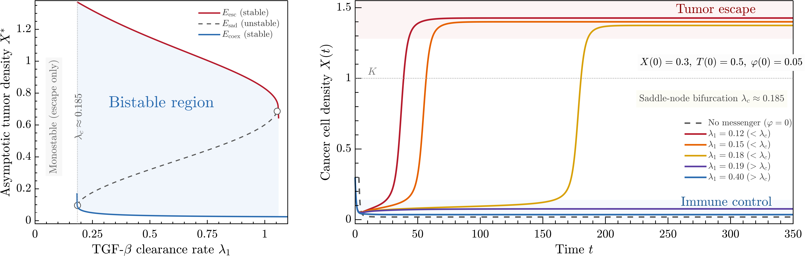
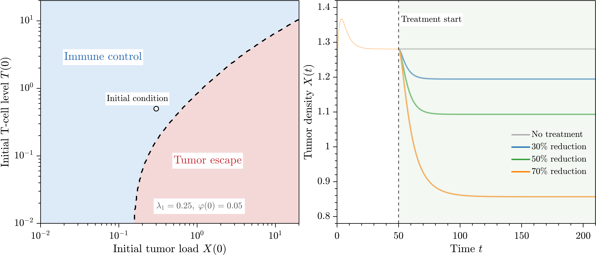
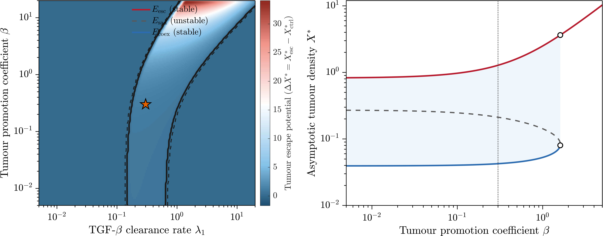
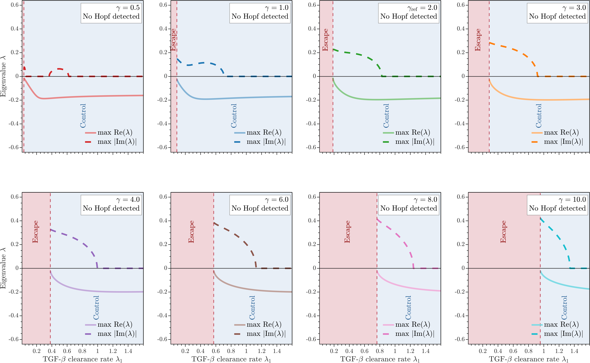

# TFGBeta messenger KTAP simulations


This repository accompanies the manuscript:

**Kinetic Theory of Active Particles with Sub-Cellular Messengers: A Multiscale Mediator Framework with Application to Tumour-Immune Bistability**

The MATLAB scripts generate supplementary Figures S1-S4 from the reduced tumour-immune-TGF-beta ODE model. An independent Python calculation checks the fold values used in Figure S1. The tracked `.mat` records preserve the numerical arrays, parameters, run configuration, and MATLAB version associated with each figure.

## Figure gallery

The previews below were generated by `run_all_figures("release")`. The same command also writes the individual panels, vector PDFs, and `.mat` data records.

### S1. Clearance-driven bistability



**Figure S1.** Steady-state tumour density as a function of the TGF-beta clearance rate, together with tumour trajectories from $X(0)=0.3$, $T(0)=0.5$, and $\varphi(0)=0.05$. The left panel shows the stable escape and coexistence branches separated by the unstable saddle branch. The right panel compares $\lambda_1=0.12, 0.15, 0.18, 0.19$, and $0.40$ with the messenger-free reference. The lower fold used in the figure is $\lambda_c \approx 0.185$.

### S2. Initial conditions and simulated intervention



**Figure S2.** Dependence on initial conditions and on a simulated reduction in tumour-derived messenger production. The left panel classifies the final state over $(X(0),T(0))$ at $\lambda_1=0.25$ and $\varphi(0)=0.05$; the dashed curve is the $X^*=0.5$ classification boundary. In the right panel, $\delta_1$ is reduced by 0%, 30%, 50%, or 70% at $t=50$, and $X(t)$ is followed to $t=210$.

### S3. Sensitivity to clearance and tumour promotion



**Figure S3.** Parameter scan in the $(\lambda_1,\beta)$ plane. The left panel shows $\Delta X^*=X^*_{\mathrm{esc}}-X^*_{\mathrm{ctrl}}$, computed from low- and high-tumour initial states. The solid and dashed contours mark $\Delta X^*=0.30$ and $0.02$, respectively; the star marks $(\lambda_1,\beta)=(0.30,0.30)$. The right panel traces the escape, saddle, and coexistence equilibria as $\beta$ varies at $\lambda_1=0.30$.

### S4. Eigenvalue continuation



**Figure S4.** Linear stability along the coexistence equilibrium branch for $\gamma=0.5, 1, 2, 3, 4, 6, 8$, and $10$. Each panel plots the largest real part and the largest absolute imaginary part of the Jacobian eigenvalues against $\lambda_1$. The vertical dashed line marks the first sampled point on the branch. No Hopf crossing is detected over the computed interval.

## Repository layout

```text
code/
  make_S1_matlab.m          # Figure S1: bifurcation diagram and time series
  make_S2_matlab.m          # Figure S2: basins and intervention trajectories
  make_S3_matlab.m          # Figure S3: sensitivity in (lambda_1, beta)
  make_S4_matlab.m          # Figure S4: eigenvalue continuation
  run_all_figures.m         # one-command MATLAB driver
  check_matlab_release.m    # MATLAB static and smoke checks
  verify_folds_TFGBeta.py   # independent Python fold verification
docs/
  REPRODUCIBILITY.md
  GITHUB_ZENODO_RELEASE.md
  RELEASE_CHECKLIST.md
outputs_reference/
  README.md                 # notes on archived reference outputs
tools/
  static_check_repo.py      # repository-level static checker
```

## Requirements

### MATLAB

- MATLAB R2021a or newer.
- Optimization Toolbox for `fsolve`, used by `make_S4_matlab.m`.

The scripts also use `ode113`, `deval`, `fzero`, `exportgraphics`, and standard plotting functions.

### Python

Python is needed only for the independent fold check:

```bash
python -m venv .venv
# macOS or Linux
source .venv/bin/activate
# Windows PowerShell
.venv\Scripts\Activate.ps1
python -m pip install -r requirements.txt
python code/verify_folds_TFGBeta.py
```

## Generate the figures

From the repository root, run the release profiles in MATLAB:

```matlab
cd code
run_all_figures("release")
```

For a quicker smoke test:

```matlab
cd code
run_all_figures("fast")
```

The four figure builders can also be run separately:

```matlab
make_S1_matlab("publication")
make_S2_matlab("publication")
make_S3_matlab("final")
make_S4_matlab("final")
```

## Generated files

Each figure builder writes to its own directory:

```text
code/matlab_outputs/S*/panels/    # individual PNG and vector PDF panels
code/matlab_outputs/S*/previews/  # combined PNG and vector PDF previews
code/matlab_outputs/S*/data/      # .mat data, parameters, configuration, and metadata
```

Generated PNG and PDF files are ignored by Git. The four light-background images in `assets/previews/` are the curated copies displayed on this page; the `.mat` records under `code/matlab_outputs/S*/data/` remain tracked.

## Checks

Run the repository check from the command line:

```bash
python tools/static_check_repo.py
```

Then run the MATLAB static check:

```matlab
cd code
check_matlab_release(false)
```

Set the argument to `true` for the optional MATLAB smoke test. The full protocol is documented in [docs/REPRODUCIBILITY.md](docs/REPRODUCIBILITY.md).

## Citation

Machine-readable citation metadata are provided in `CITATION.cff`. The Zenodo DOI has not yet been minted, so the entry below is a release template rather than a current DOI record.

```bibtex
@software{torres2026tfgbeta,
  author    = {Elena Torres Lozano and Juan Calvo and Rene Fabregas and Juan Soler},
  title     = {TFGBeta messenger KTAP simulations},
  year      = {2026},
  publisher = {Zenodo},
  version   = {v1.0.0},
  doi       = {10.5281/zenodo.xxxxxxx},
  url       = {https://doi.org/10.5281/zenodo.xxxxxxx}
}
```

After Zenodo archives the GitHub release, replace `zenodo.xxxxxxx` here and in `CITATION.cff` and `.zenodo.json`.

## License

The code is released under the MIT License. See [LICENSE](LICENSE).
